# CarRentalSystem

blockchain2023 homework

## 如何运行

1. 在本地启动ganache应用，将端口号设为8545

2. 将ganache中生成的测试账户的私钥复制到`./contracts/hardhat.config.ts`文件的`accounts`中

3. 在 `./contracts` 中安装需要的依赖，运行如下的命令：

    ```bash
    npm install
    ```

4. 在 `./contracts` 中编译合约，运行如下的命令：

    ```bash
    npx hardhat compile
    ```

5. 将合约部署到ganache本地链上，在 `./contracts` 中运行如下的命令

   ```bash
    npx hardhat run ./scripts/deploy.ts --network ganache
    ```

6. 将得到的合约地址复制到 `frontend/src/utils/contract-address.json` 中

7. 在 `./frontend` 中安装需要的依赖，运行如下的命令：

    ```bash
    npm install
    ```

8. 在 `./frontend` 中启动前端程序，运行如下的命令：

    ```bash
    npm run start
    ```

## 功能实现分析

1. 发行汽车NFT

- 调用`ERC4907._mint`函数
- 无法直接`import ERC4907`故我将`github`上的源码部署到本地了

2. 获得合约发行的积分

- 调用`ERC20._mint()`函数

3. 查看自己拥有的汽车

- 使用一个从拥有者地址到汽车列表的映射 `mapping(address => uint256[]) carList`

4. 查看当前可租的汽车

- 遍历所有的汽车，输出`car.rentDDL`比`block.timestamp`小的汽车列表

5. 查询一辆车的拥有者和借用者

- 使用`ERC4907.ownerOf()` `ERC4907.useOf()`函数

6. 借用一辆车一定的时间

- 使用`ERC4907.setUser()`函数

## 项目运行截图

1. 主页面


2. 领取空投积分

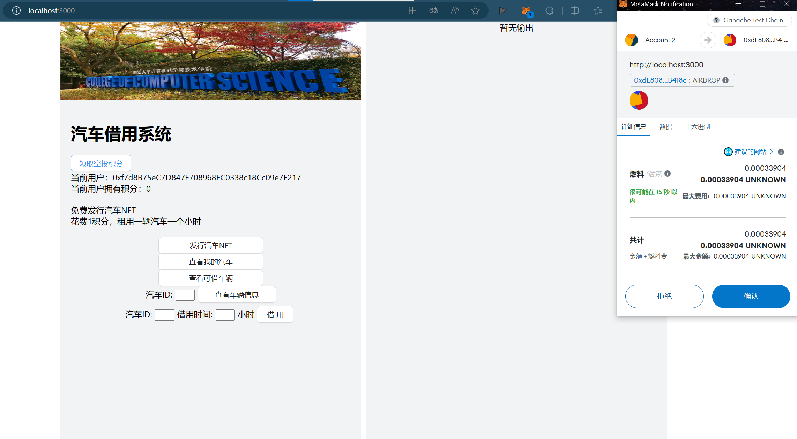


3. 发行汽车NFT

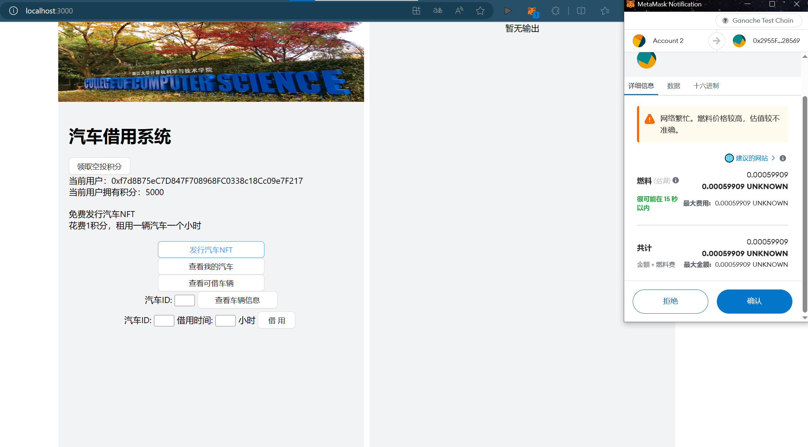
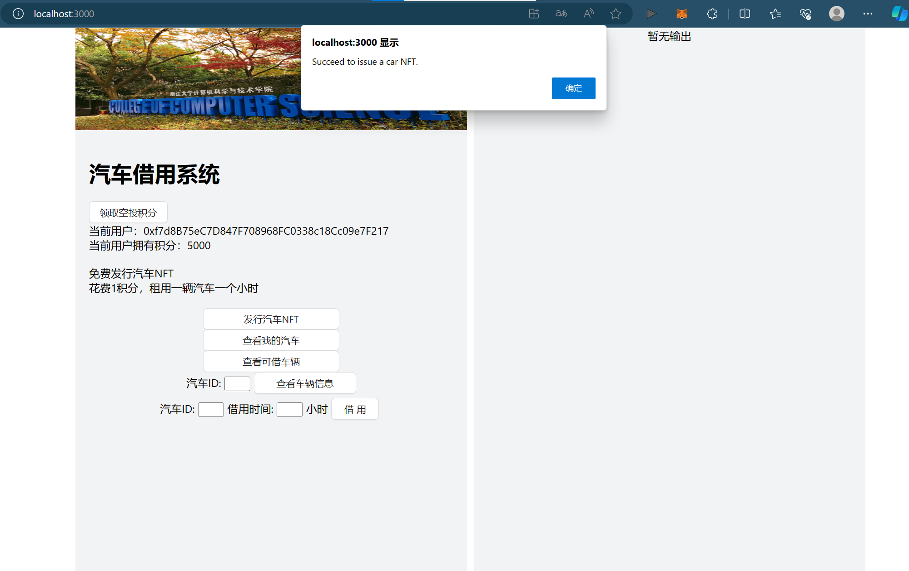

4. 查看我所拥有的汽车NFT

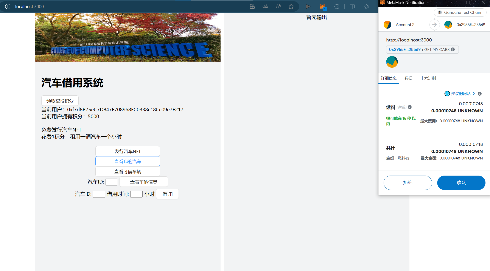
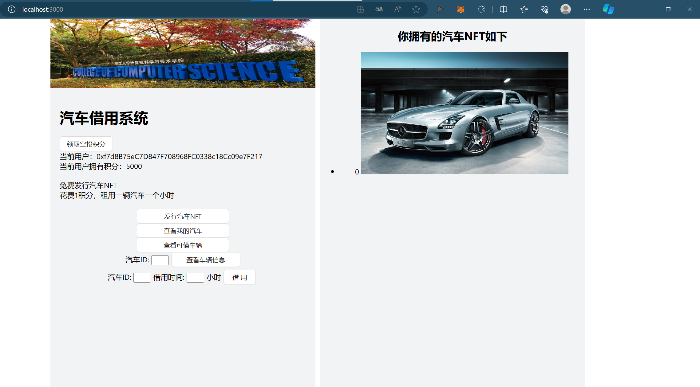

5. 再多发行几个汽车NFT，查看可借车辆

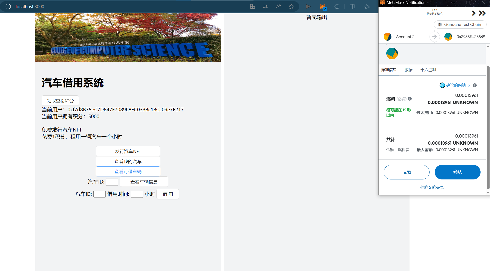
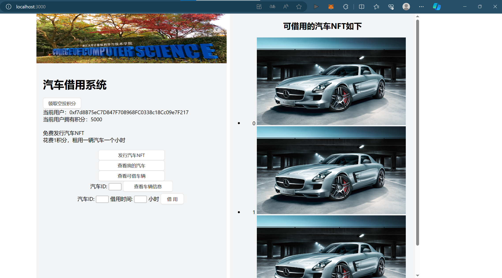

6. 查看`汽车0`的信息，只有拥有者，无借用者

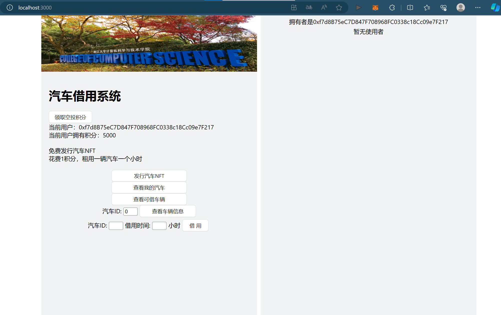

7. 借用`汽车0` 5个小时

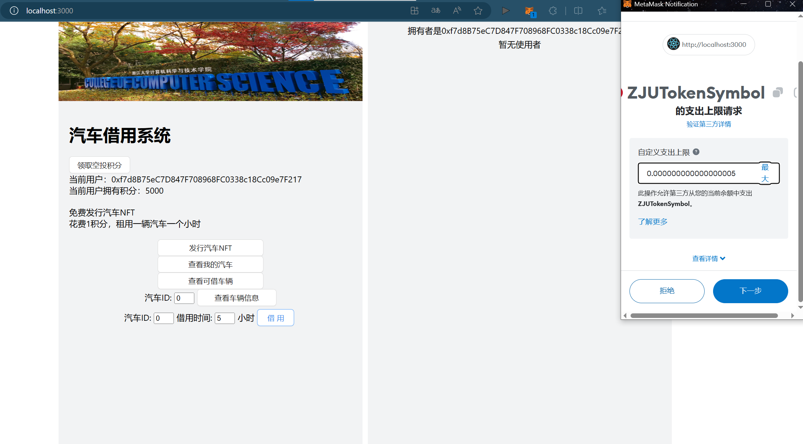

8. 再查看`汽车0`的信息，此时既有拥有者，又有借用者

**此时拥有者与借用者为同一人，故积分无变化**


9. 再次查看可借车辆，发现汽车0不在列表中了


10. 此时切换用户，借用`汽车1` 5个小时

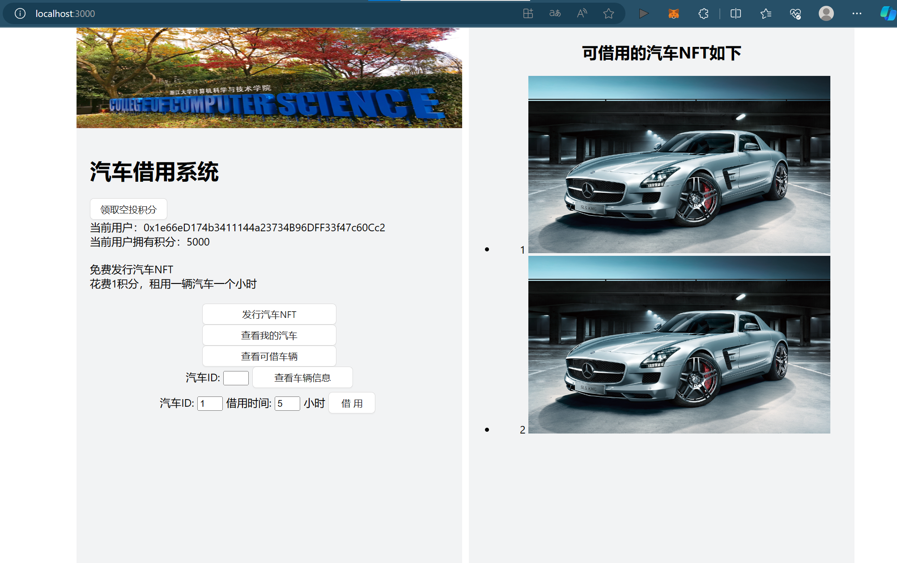

11. 再查看`汽车1`的信息，拥有者为上一用户，借用者为当前用户

**此时积分发生变化，减少了5积分**


12. 再次查看可借车辆，发现列表中只剩`汽车2`

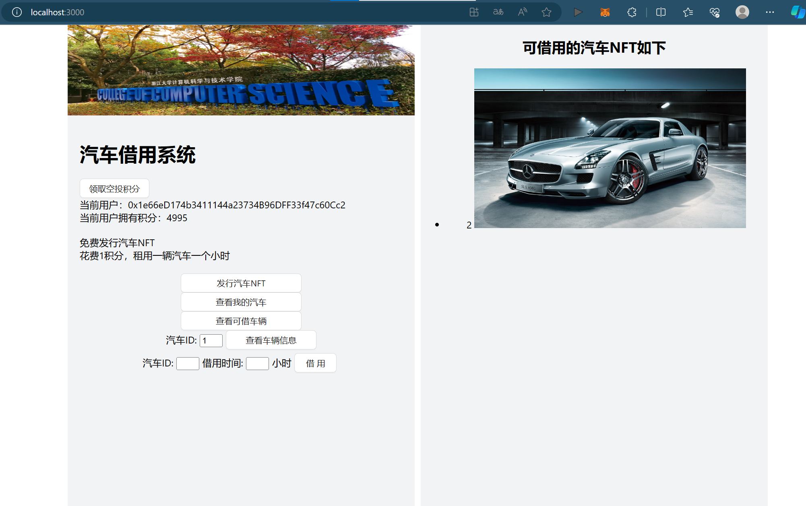

13. 切换回上一用户，发现增加了5积分

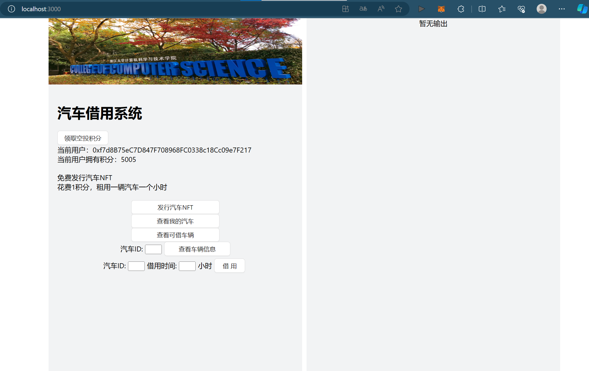

## 参考内容

- [课程的参考DEMOs](https://github.com/LBruyne/blockchain-course-demos)。

- [ERC-4907](https://eips.ethereum.org/EIPS/eip-4907)

- [ChatGPT](https://chat.openai.com/)
